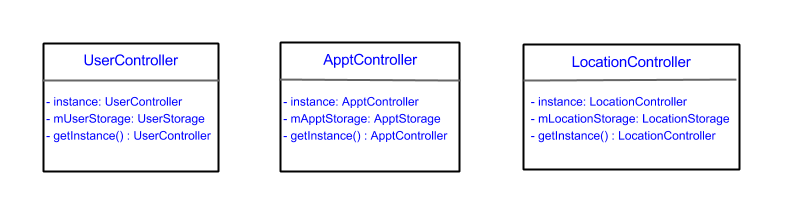
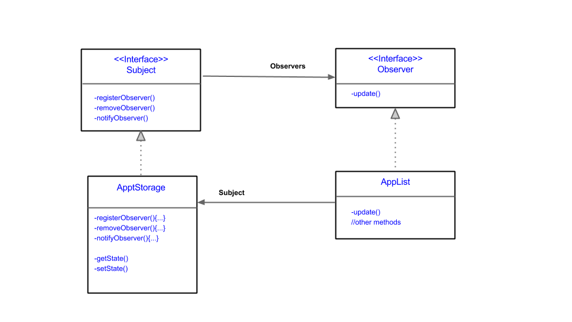

# Mediator Pattern

## Motivation

The calendar project requires numerous GUI components and data components to communicate simultaneously and complex integration due to many relationships among different data objects. 
For this reason, if handling of data is implemented on the GUI side, it is impossible track down where data components are modified or created.
Also, if integration among different data objects are all done on the unit side, it is not possible to handle many data objects at the same time. 

## Solution

We imitated the Model-View-Controller(MVC) architecture from the web application platform, Ruby on Rails, to mediate the model(data object) and view(GUI component) with having controllers.
Controllers, each of which hold data objects like Appt, User, Notification, Invitation, and Location, are implemented in singleton pattern, so that GUI components easily communicate with data objects through them.
Integrations among different data objects, such as Appt and Notification, or User and Appt, are handled through different methods of controllers. 
As a result, each controller has one-to-many relationship with data objects, which makes the code maintenance simpler with centralized control logic.

## Class Diagram

# Singleton Pattern

## Motivation

In the calendar project, Model-View-Controller(MVC) architecture was employed and therefore, most of the data manipulating process rely on the controller units, for example, ApptController, UserController, LocationController and so on.
Therefore, if there is any data to be manipulated, a controller object would be needed. Without Singleton Pattern, for every data manipulation, a controller object would be instantiated.
If the calendar is utilized by many users, massive amount of data should be manipulated and hence, the number of controller objects will grow uncontrollably.
In the current system, all the data of a specific type (e.g appointment) is stored in ONE respective storage unit (e.g appointment storage unit). 
And this implies that all the controller objects of the same type should refer to ONE respective storage unit.
Therefore, a single specific-type controller object with reference to its respective storage unit is sufficient to handle all the data manipulation of its type, instead of unnecessarily creating a controller object every time whenever data manipulation is required.
Furthermore, creating many controller objects would be inefficient because once a controller object is created and used for a data manipulation process, it would not be used again for another data manipulation (since a new controller object is created for another data manipulation) and this will eventually  
lead to waste of memory resources. If too many objects are created in this way, this might even cause the program to crash.

## Solution  

We implemented the controller units of the different types of data in Singleton Pattern, which we learnt from the lecture, to ensure that only ONE object is instantiated for each controller unit classes.
As a consequence of using Singleton Pattern, there was no waste of memory resources since it prevented creating controller objects unnecessarily. 
Manipulation of data of a specific type is done by referring to the Singleton object of the controller of its type. 
For example, when creating an Appt, a method *createNewAppt()* is called from the Singleton object of the ApptController. 
Singleton Pattern not only improved efficiency and stability of the program but also enhanced the code style and maintainability, due to the fact that no extra lines of instantiation of controller objects were required and all data manipulation referred to one single object.

## Class Diagram

# Observer Pattern

## Motivation

In the current implementation of the calendar system, any action that is related to the switching of currently selected dates( day, month or year) 
and operations on appointments will trigger both the GUI for daily view and GUI for monthly view of appointments to update.
It is compulsory for the switching of currently selected dates to trigger an update in the daily view and monthly view, but the case does not hold true for operations on appointments. 
For example, the daily view and monthly view does not need update if the creation/modification/deletion are performed on appointment that is not included in the current day or month, but we redraw the daily view and monthly view whenever there is change to the appointment. Also, maintenance issue arises when the design of the GUI is changed, since it is hard to track which changes are being made.  
Evidently, these redundant updates are unnecessary, thus wasting memory resource, and code maintenance is problematic.

## Solution  

After some discussion, we drew a conclusion that solution to preventing redundant updates and improve code maintenance could be achieved by adopting the observer pattern, we have learnt from the lecture.
Therefore, in the future implementation, subject and observer relationship can be established between appointment storage and GUI for daily view and monthly view. 
Even in the current implementation, observer pattern exists between the buttons (Subject) that change dates and GUI for daily view and monthly view(Observer), in form of button(subject) and actionListener(observer).
Whenever action is performed in the button(state is changed), the actionListener will update the GUI that is related to the change.
Similarly, this observer pattern can also be applied to appt storage and GUI for daily view and monthly view and whenever there is relevant
state changes in the appt storage related to daily view and monthly view, the GUI for daily view and monthly view will update.

## Class Diagram

